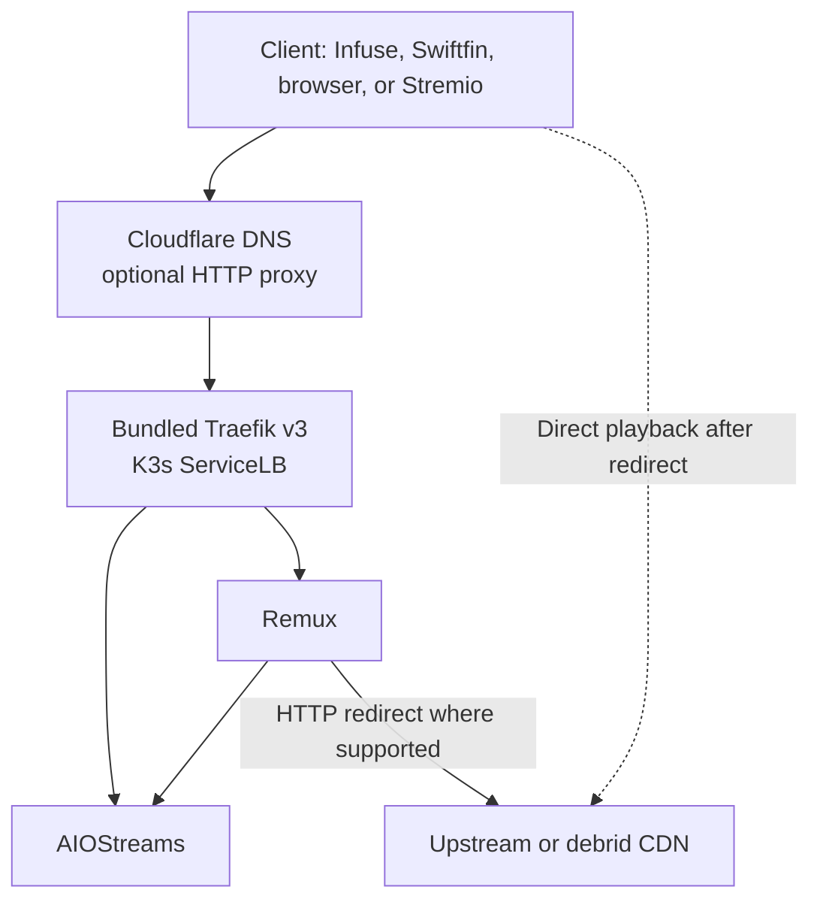

# K3s Streaming Stack

A small, reproducible K3s-based streaming stack using bundled Traefik, AIOStreams, and Remux.

> This is an independent project. It is not affiliated with, sponsored by, or maintained by K3s, Traefik, cert-manager, AIOStreams, Remux, Cloudflare, or the reference projects.

## 1. Purpose

This repository documents and incrementally implements a focused streaming stack on a Debian 13 VM running under Proxmox VE. It is intended to be understandable, reproducible, self-healing within a single node, and low-maintenance without unnecessary control planes.

The current milestone implements and validates the AIOStreams workload on the
existing K3s platform. Remux remains future work because its upstream contract
and migration/redirect behavior still require separate validation.

## 2. Scope

In scope:

- A single-node K3s cluster using the bundled containerd, Traefik v3, CoreDNS, and local-path storage.
- AIOStreams with SQLite, persistent `/app/data`, native authentication, and public HTTPS ingress.
- A documented future Remux workload with SQLite and persistent `/data`.
- Cloudflare-managed DNS.
- cert-manager with ACME DNS-01 and a narrowly scoped Cloudflare API token.
- Renovate awareness for Kubernetes and platform image references under `k8s/`.

Explicitly out of scope for v0.1:

- A multi-node cluster or high availability.
- Docker, Podman, Longhorn, Ceph, NFS, Redis, or PostgreSQL.
- Argo CD, Flux, Prometheus, Grafana, or unnecessary dashboards/control planes.
- Remux, Authelia, Keel, external-dns, and any automatic application updater in this milestone.
- Committing real domains, addresses, credentials, kubeconfig files, or private keys.

## 3. Architecture

The target is a Debian 13 VM, not an LXC container. The validated platform
uses one K3s server with bundled containerd, Traefik, CoreDNS, ServiceLB,
local-path storage, metrics-server, and cert-manager. AIOStreams is a separate
one-replica workload with local persistent data; Remux remains future work.
Traefik is the only ingress controller.

The Proxmox underlay uses MTU 9000 through the physical network, bridge, VirtIO NIC, and Debian guest. The VM provisioning path declares the NIC MTU explicitly. The future K3s CNI/Flannel overlay MTU is intentionally not pinned here; it will be measured and validated after K3s bootstrap.



Remux should eventually expose Jellyfin-compatible APIs, catalog, and search to
a compatible client. Where it supports an HTTP redirect to an upstream/debrid
URL, the client should fetch video directly so bytes bypass the K3s host.
AIOStreams remains publicly reachable for independent configuration and as a
direct Stremio fallback until Remux is validated. If AIOStreams later becomes
internal-only, Remux must never redirect clients to a `*.svc.cluster.local` or
other client-unreachable URL.

## 4. Why K3s

K3s provides the real Kubernetes API and primitives with a smaller operational footprint suited to a single-node homelab. Its bundled containerd, CoreDNS, Traefik, and local-path provisioner avoid a second container runtime and reduce bootstrap choices while leaving a normal Kubernetes migration path open.

The cluster is intentionally single-node in v0.1. That keeps failure modes and storage behavior explicit rather than implying availability that the platform does not provide.

## 5. Why a VM instead of LXC

The VM provides a dedicated guest kernel and a conventional Linux/Kubernetes boundary. This is a cleaner Kubernetes learning and troubleshooting environment, avoids several nested-container cgroup and AppArmor interactions, and is closer to a VPS, cloud, or bare-metal node. The additional memory and disk overhead are accepted as the cost of a more portable operational model.

See [`docs/proxmox-vm.md`](docs/proxmox-vm.md) and [ADR-0001](docs/decisions/0001-vm-over-lxc.md) for the platform contract.

## 6. Main workloads

### AIOStreams

[AIOStreams](https://github.com/Viren070/AIOStreams) is the primary stream-aggregation backend. This milestone deploys one replica, SQLite, persistent `/app/data`, native authentication/configuration protection, and public HTTPS ingress. It deliberately follows the upstream stable `latest` image with `imagePullPolicy: Always`; see [`k8s/aiostreams/README.md`](k8s/aiostreams/README.md). No Redis or PostgreSQL dependency is assumed.

### Remux

[Remux](https://github.com/lostb1t/remux) is the client-facing compatibility layer for the intended user flow. The planned first deployment is one replica, SQLite, and persistent `/data`. Remux is treated as early-stage software: image updates require review, and rollback must remain possible.

## 7. Cloudflare and TLS

Cloudflare is the DNS authority. The validated cert-manager platform obtains
certificates through Let's Encrypt DNS-01 using a Cloudflare API token limited
to DNS edit and zone read for the one relevant zone. The real token is supplied
out of band and never stored in Git. The AIOStreams hostname is configured
DNS-only to select direct-origin semantics; DNS-only does not itself prove that
the origin is reachable from the public Internet. The current evidence
validates the HTTPS route from the operator network, while external reachability
remains a separate unresolved gate; see the validation report.

The initial operational default is DNS-only during bring-up. This keeps the client-to-edge behavior easy to observe and avoids making Cloudflare the assumed streaming proxy. HTTP proxying can be enabled deliberately per hostname after confirming the workload behavior, Cloudflare terms and limits, and Traefik trusted-proxy configuration. If proxying is enabled, Traefik must trust `X-Forwarded-*` headers only from Cloudflare's current published IP ranges, never from arbitrary clients.

See [`docs/cloudflare.md`](docs/cloudflare.md) for the DNS-01, proxy, and certificate lifecycle.

## 8. Security philosophy

- Public files contain examples and placeholders only, such as `stream.example.com`.
- Cloudflare tokens, debrid credentials, AIOStreams keys, kubeconfig files, and private keys stay outside Git.
- Credentials are scoped to the smallest zone and permission set needed.
- Ingress is explicit; an application is not exposed merely because its Service exists.
- Storage is persistent but local to the VM. A single-node local-path volume is not a backup.
- AIOStreams native authentication protects human/configuration surfaces while
  public Stremio machine paths remain usable. No blanket ForwardAuth is used.
- Changes are reproducible and observable. Future workload automation must
  include health and recovery gates; platform changes remain reviewed.

## 9. Update strategy

The intended future workload flow is:

```text
stable upstream release -> digest detection -> controlled Kubernetes rollout -> health/readiness and recovery validation
```

This milestone does not deploy an automatic application updater. AIOStreams
intentionally tracks stable `latest`; Keel is the leading future candidate,
subject to digest observation, health gates, and mutable-tag rollback proof.
Renovate remains review-oriented platform/dependency awareness, with automerge
disabled. See [`docs/upgrade-strategy.md`](docs/upgrade-strategy.md),
[`docs/plan.md`](docs/plan.md), and
[`docs/decisions/0006-automatic-application-updates.md`](docs/decisions/0006-automatic-application-updates.md).

## 10. Roadmap

See the living roadmap in [`docs/plan.md`](docs/plan.md). Phases 0–2 are
validated; Phase 3 is the current AIOStreams deployment; Remux, selective
Authelia, bounded application updates, optional DNS automation, and operational
polish remain sequenced future phases.

## 11. Current project status

The repository contains a validated Proxmox/Debian bootstrap, pinned
single-node K3s platform baseline, and cert-manager/Cloudflare DNS-01 TLS
foundation. The AIOStreams workload and its redacted live-validation results
are recorded in [`k8s/aiostreams/README.md`](k8s/aiostreams/README.md) and the
[`AIOStreams validation report`](docs/validation/aiostreams-2026-08-27.md).
Remux, Authelia, Keel, and external-dns are not deployed.

## 12. Upstream and reference projects

This project is original Kubernetes-native work informed by, but not copied from, these projects:

- Architectural reference: [Viren070/docker-compose-template](https://github.com/Viren070/docker-compose-template) (MIT).
- Workload: [Viren070/AIOStreams](https://github.com/Viren070/AIOStreams) (AGPL-3.0).
- Workload: [lostb1t/remux](https://github.com/lostb1t/remux) (AGPL-3.0).
- Platform: [K3s](https://github.com/k3s-io/k3s) (Apache-2.0).
- Ingress: [Traefik](https://github.com/traefik/traefik) (MIT).
- Certificates: [cert-manager](https://github.com/cert-manager/cert-manager) (Apache-2.0).
- DNS and API: [Cloudflare](https://www.cloudflare.com/).

Licenses were checked before this bootstrap. No substantial upstream code or configuration is copied here.

## Repository map

```text
docs/                 Architecture and operations documentation
docs/decisions/       Short architecture decision records
infra/proxmox/        Debian Cloud-Init template and VM clone automation
scripts/verify/       Guest and workload verification scripts
k8s/                  Kubernetes-native configuration as contracts are verified
examples/             Redacted, non-secret examples only
renovate.json         Conservative image update policy
```

## License

This repository is licensed under the [MIT License](LICENSE).
