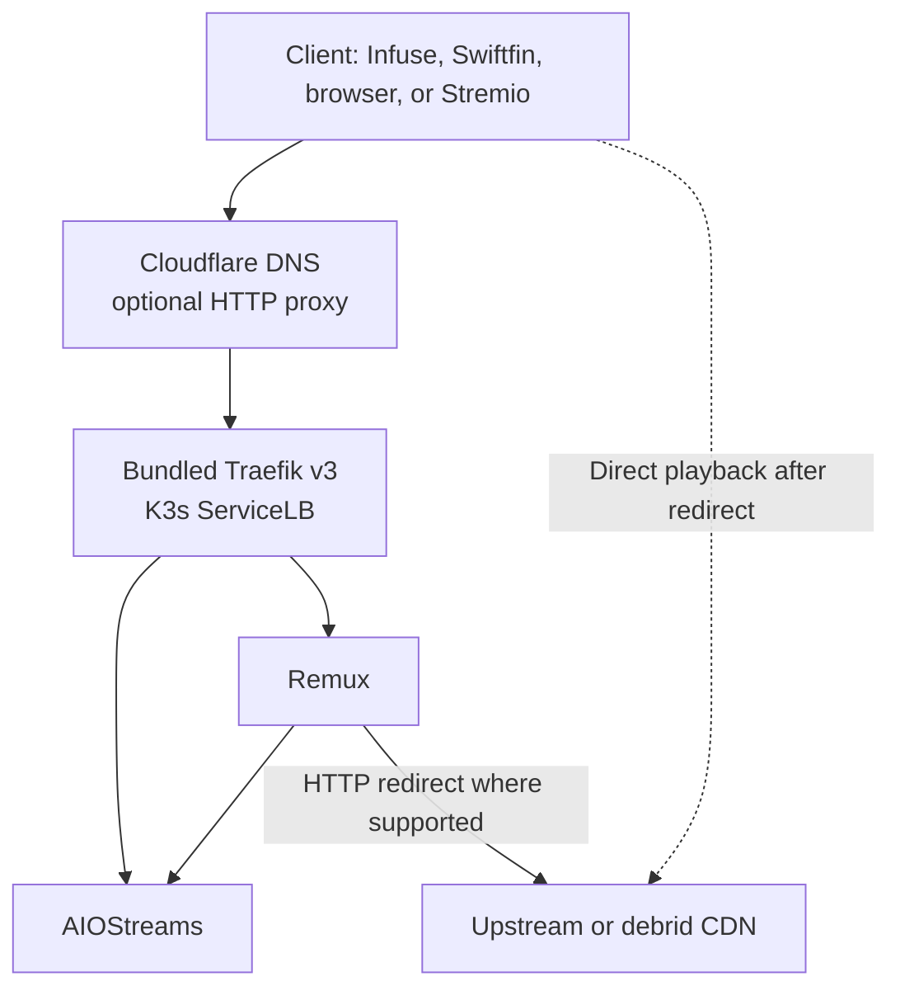

# K3s Streaming Stack

A small, reproducible K3s-based streaming stack using bundled Traefik, AIOStreams, and Remux.

> This is an independent project. It is not affiliated with, sponsored by, or maintained by K3s, Traefik, cert-manager, AIOStreams, Remux, Cloudflare, or the reference projects.

## 1. Purpose

This repository documents and incrementally implements a focused streaming stack on a Debian 13 VM running under Proxmox VE. It is intended to be understandable, reproducible, and safe to update through reviewable GitHub pull requests.

The first release is an architecture and operations baseline. It deliberately does not claim to be a ready-to-run deployment until the current upstream contracts for AIOStreams and Remux have been verified and encoded in Kubernetes manifests.

## 2. Scope

In scope:

- A single-node K3s cluster using the bundled containerd, Traefik v3, CoreDNS, and local-path storage.
- AIOStreams with SQLite and persistent `/app/data`.
- Remux with SQLite and persistent `/data`.
- Cloudflare-managed DNS.
- cert-manager with ACME DNS-01 and a narrowly scoped Cloudflare API token.
- Renovate pull requests for Kubernetes image references under `k8s/`.

Explicitly out of scope for v0.1:

- A multi-node cluster or high availability.
- Docker, Podman, Longhorn, Ceph, NFS, Redis, or PostgreSQL.
- Argo CD, Flux, Prometheus, Grafana, or blind runtime image updates.
- Committing real domains, addresses, credentials, kubeconfig files, or private keys.

## 3. Architecture

The target is a Debian 13 VM, not an LXC container. The current bootstrap milestone builds that VM from a verified Debian Cloud-Init template; it does not install K3s yet. When the later Kubernetes milestone begins, K3s will own the node and use its bundled containerd. Bundled Traefik will be the only ingress controller. AIOStreams and Remux are separate one-replica workloads with local persistent data; their manifests are intentionally deferred until upstream image and configuration contracts are validated.

The Proxmox underlay uses MTU 9000 through the physical network, bridge, VirtIO NIC, and Debian guest. The VM provisioning path declares the NIC MTU explicitly. The future K3s CNI/Flannel overlay MTU is intentionally not pinned here; it will be measured and validated after K3s bootstrap.



Remux should expose Jellyfin-compatible APIs, catalog, and search to a compatible client. Where Remux supports an HTTP redirect to the upstream/debrid URL, the client fetches video directly from that upstream endpoint; video bytes should not traverse the K3s host. AIOStreams remains directly reachable for administration and as an emergency direct AIOStreams/Stremio fallback.

## 4. Why K3s

K3s provides the real Kubernetes API and primitives with a smaller operational footprint suited to a single-node homelab. Its bundled containerd, CoreDNS, Traefik, and local-path provisioner avoid a second container runtime and reduce bootstrap choices while leaving a normal Kubernetes migration path open.

The cluster is intentionally single-node in v0.1. That keeps failure modes and storage behavior explicit rather than implying availability that the platform does not provide.

## 5. Why a VM instead of LXC

The VM provides a dedicated guest kernel and a conventional Linux/Kubernetes boundary. This is a cleaner Kubernetes learning and troubleshooting environment, avoids several nested-container cgroup and AppArmor interactions, and is closer to a VPS, cloud, or bare-metal node. The additional memory and disk overhead are accepted as the cost of a more portable operational model.

See [`docs/proxmox-vm.md`](docs/proxmox-vm.md) and [ADR-0001](docs/decisions/0001-vm-over-lxc.md) for the platform contract.

## 6. Main workloads

### AIOStreams

[AIOStreams](https://github.com/Viren070/AIOStreams) is the primary stream-aggregation backend. The planned first deployment is one replica, SQLite, persistent `/app/data`, and native authentication/configuration protection. No Redis or PostgreSQL dependency is assumed.

### Remux

[Remux](https://github.com/lostb1t/remux) is the client-facing compatibility layer for the intended user flow. The planned first deployment is one replica, SQLite, and persistent `/data`. Remux is treated as early-stage software: image updates require review, and rollback must remain possible.

## 7. Cloudflare and TLS

Cloudflare is the DNS authority. cert-manager will obtain certificates through Let's Encrypt DNS-01 using a Cloudflare API token limited to DNS edit and zone read for the one relevant zone. The real token is supplied out of band and never stored in Git.

The initial operational default is DNS-only during bring-up. This keeps the client-to-edge behavior easy to observe and avoids making Cloudflare the assumed streaming proxy. HTTP proxying can be enabled deliberately per hostname after confirming the workload behavior, Cloudflare terms and limits, and Traefik trusted-proxy configuration. If proxying is enabled, Traefik must trust `X-Forwarded-*` headers only from Cloudflare's current published IP ranges, never from arbitrary clients.

See [`docs/cloudflare.md`](docs/cloudflare.md) for the DNS-01, proxy, and certificate lifecycle.

## 8. Security philosophy

- Public files contain examples and placeholders only, such as `stream.example.com`.
- Cloudflare tokens, debrid credentials, AIOStreams keys, kubeconfig files, and private keys stay outside Git.
- Credentials are scoped to the smallest zone and permission set needed.
- Ingress is explicit; an application is not exposed merely because its Service exists.
- Storage is persistent but local to the VM. A single-node local-path volume is not a backup.
- Changes are reviewed and reproducible. Update automation may propose a change but does not apply it at runtime.

## 9. Update strategy

The intended flow is:

```text
upstream image -> Renovate PR -> review and validation -> merge -> Kubernetes rollout
```

Renovate is configured for Kubernetes references beneath `k8s/`, with automerge disabled. Versioned tags are preferred where the upstream release process supports them; digest pinning is desirable once a real manifest and update workflow exist. Remux updates receive deliberate compatibility review. See [`docs/upgrade-strategy.md`](docs/upgrade-strategy.md).

## 10. Roadmap

1. Build the pinned Debian 13 template, clone `k3s01`, and verify the Debian baseline. (Validated.)
2. Install the pinned single-node K3s server only after the Debian baseline passes. (Validated.)
3. Measure and validate the K3s CNI/Flannel MTU against the 9000-byte VM underlay; do not copy the underlay value blindly. (Validated locally on one node.)
4. Verify current AIOStreams and Remux image names, tags, ports, health behavior, persistence paths, and configuration requirements from their primary repositories.
5. Add minimal Kubernetes-native manifests and example-safe configuration for the workloads.
6. Add cert-manager and Traefik configuration using the supported K3s HelmChartConfig path, then validate staging certificates, ingress, persistence, redirect behavior, and rollback.
7. Run the single-node stack, document observed operational commands, and promote only proven configuration.

## 11. Current project status

The repository contains a validated Proxmox/Debian bootstrap and a pinned
single-node K3s platform baseline. `k3s01` is Ready with bundled CoreDNS,
Traefik, ServiceLB, local-path, and metrics-server validated through reboot;
the observed Flannel overlay MTU is recorded in [`infra/k3s/README.md`](infra/k3s/README.md).
No AIOStreams, Remux, cert-manager, Cloudflare integration, or application
Ingress manifests have been deployed or claimed as production-ready.

## 12. Upstream and reference projects

This project is original Kubernetes-native work informed by, but not copied from, these projects:

- Architectural reference: [Viren070/docker-compose-template](https://github.com/Viren070/docker-compose-template) (MIT).
- Workload: [Viren070/AIOStreams](https://github.com/Viren070/AIOStreams) (AGPL-3.0).
- Workload: [lostb1t/remux](https://github.com/lostb1t/remux) (AGPL-3.0).
- Platform: [K3s](https://github.com/k3s-io/k3s) (Apache-2.0).
- Ingress: [Traefik](https://github.com/traefik/traefik) (MIT).
- Certificates: [cert-manager](https://github.com/cert-manager/cert-manager) (Apache-2.0).
- DNS and API: [Cloudflare](https://www.cloudflare.com/).

Licenses were checked before this bootstrap. No substantial upstream code or configuration is copied here.

## Repository map

```text
docs/                 Architecture and operations documentation
docs/decisions/       Short architecture decision records
infra/proxmox/        Debian Cloud-Init template and VM clone automation
scripts/verify/       Guest baseline verification scripts
k8s/                  Kubernetes-native configuration as contracts are verified
examples/             Redacted, non-secret examples only
renovate.json         Conservative image update policy
```

## License

This repository is licensed under the [MIT License](LICENSE).
